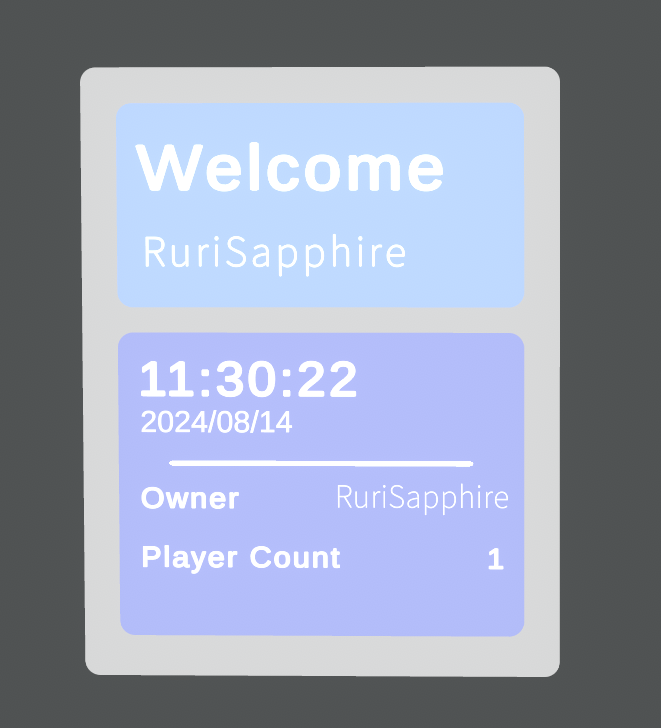

# Simple Welcome Board

A simple welcome board for VRChat Worlds with Udon

Simple Welcome Boardは、VRChat向けのワールド情報表示用ギミックです

このギミックはVRChatのAPIを利用しています。そのままではVRChat以外での利用ができません。

Unity 2022.3.22f1対応。Unity 2019は対応する予定がありません。

This board requires VRChat API, without VRChat SDK this thing won't work.

Made with Unity 2022.3.22f1, Unity 2019 will not be supported

Noto Sans JP is used under OFL license.

group.png is used under MIT license by [Heroicons](https://heroicons.com/)

bed.png is licensed under Apache2.0 license by Google Material Design Icons

### Sample World

RuriSapphireのホームワールドでサンプルがあります。（色を少し変更しています）

A working sample is in RuriSapphire's home world. (with Minor color changes)

[VRChat](https://vrchat.com/home/world/wrld_1888e25d-e401-4bd1-a338-6794126bd227)

### Color Customization / 色改変

Welcome Boardオブジェクトの下のBG、BGUP、BGDOWNは順番で白い背景、上の背景と下の背景です。

InspectorにあるImageのコンポーネントの色を変更することで、背景色が変えられます。

BGUPとBGDOWNの下にあるオブジェクトは文字などです。Vertex Colorを変更することで文字の色を変更できます。

The BG, BGUP, BGDOWN are backgroud objects in Welcome Board object.

You can change the backgroud colors by changing the color in the Image component there.

Inside BGUP and BGDOWN objects are for text and etc. Changing the Vertex Color is a way to change the font color.

### Import / 導入

Releaseでunitypackageをダウンロードできます。

Download the unitypackage at Release section.

プレハブを好きなところにD&Dすれば完成です。

もしTextMeshProの導入ウィンドウが出てきた場合、Essentialsだけ導入すれば大丈夫です。

SDKのオフラインテスト（Play モードではない）では、Instance Ownerが「Err」になりますが、これはぶいちゃの仕様です。

Drag the prefab and put everywhere you like, the board will work itself out.

If unity asks you to import TextMeshPro, import the essentials and you're good to go. (TMPro Extra isn't required)

During Offline testing, the instance owner will be shown as "Err". It's caused by VRChat.

### If there are any issues / もしエラーが出ましたら

Please report in the issues.

issuesを書いていただけると助かります。