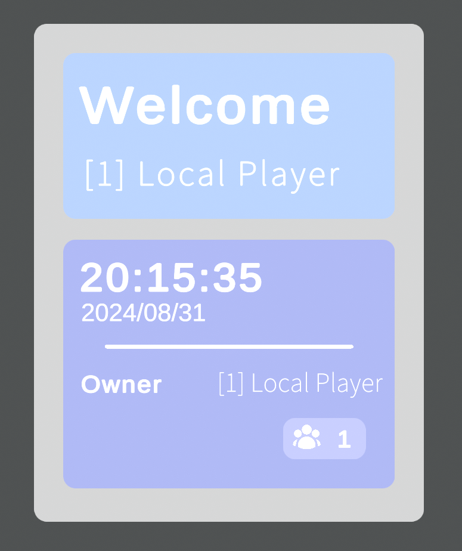

# Simple Welcome Board

A simple welcome board for VRChat Worlds with Udon

Simple Welcome Boardは、VRChat向けのWorldギミックです

This board requires VRChat API, without VRChat SDK this thing won't work.

このギミックはVRChatのAPIを利用しています。そのままではVRChat以外での利用ができません。

Made with Unity 2022.3.22f1, Unity 2019 will not be supported

Unity 2022.3.22f1対応。Unity 2019は対応する予定がありません。

Noto Sans JP is used under OFL license.

group.png is used under MIT license by [Heroicons](https://heroicons.com/)

bed.png is licensed under Apache2.0 license by Google Material Design Icons

### Sample World

A working sample is in RuriSapphire's home world. (with Minor color changes)

RuriSapphireのホームワールドでサンプルがあります。（色を少し変更しています）

[VRChat](https://vrchat.com/home/world/wrld_1888e25d-e401-4bd1-a338-6794126bd227)

### Import / 導入

Download the unitypackage at Release section.

Releaseでunitypackageをダウンロードできます。

Drag the prefab and put everywhere you like, the board will work itself out.

If unity asks you to import TextMeshPro, import the essentials and you're good to go. (TMPro Extra isn't required)

During Offline testing, the instance owner will be shown as "Err". It's a known issue.

プレハブを好きなところにD&Dすれば完成です。

もしTextMeshProの導入ウィンドウが出てきた場合、Essentialsだけ導入すれば大丈夫です。

SDKのオフラインテスト（Play モードではない）では、Instance Ownerが「Err」になりますが、これは既知の問題です。

### If there are any issues / もしエラーが出ましたら

Please report in the issues.

issuesを書いていただけると助かります。